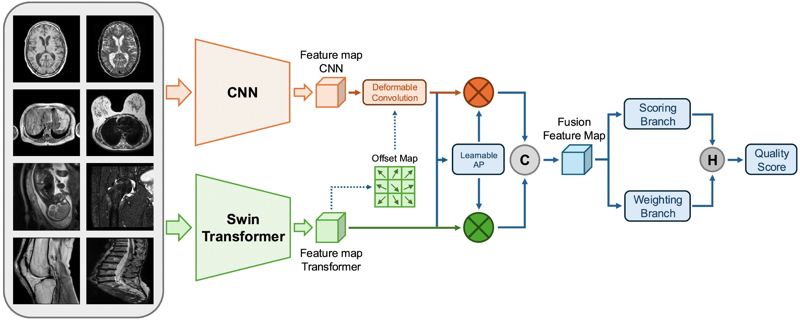

# MIQANet: A Novel Dual-Branch Deep Learning Framework for MRI Image Quality Assessment

[](https://doi.org/10.1109/TCSVT.2026.3656671)

Official code repository for the MIQANet MRI image quality assessment model.

---

## 📄 Paper

Yueran Ma, Huasheng Wang, Yingying Wu, Jean-Yves Tanguy, Richard White, Phillip Wardle, Elizabeth Krupinski, Padraig Corcoran, Hantao Liu  
MIQANet: A Novel Dual-Branch Deep Learning Framework for MRI Image Quality Assessment  
IEEE Transactions on Circuits and Systems for Video Technology (TCSVT), 2026

IEEE Xplore page:  
https://ieeexplore.ieee.org/document/11360772

DOI:  
https://doi.org/10.1109/TCSVT.2026.3656671

---

## Network Architecture


## Dataset

MIQANet is developed and evaluated using the **RAD-IQMRI** radiologist-rated MRI image quality assessment benchmark dataset.

RAD-IQMRI GitHub repository:  
https://github.com/dayan0204/RAD-IQMRI

If you use MIQANet together with this dataset, please also cite the RAD-IQMRI dataset paper.

---

## **USAGE**
```sh
python train.py
```

## **Requirements**
```sh
pip install -r requirements.txt
```

## **Citation**
```sh
@ARTICLE{11360772,
  author={Ma, Yueran and Wang, Huasheng and Wu, Yingying and Tanguy, Jean-Yves and White, Richard and Wardle, Phillip and Krupinski, Elizabeth and Corcoran, Padraig and Liu, Hantao},
  journal={IEEE Transactions on Circuits and Systems for Video Technology}, 
  title={MIQANet: A Novel Dual-Branch Deep Learning Framework for MRI Image Quality Assessment}, 
  year={2026},
  volume={},
  number={},
  pages={1-1},
  keywords={Magnetic resonance imaging;Image quality;Measurement;Quality assessment;Noise;Degradation;Visualization;Medical diagnostic imaging;Deep learning;Computational modeling;Image quality assessment;medical image;deep learning;artifacts;MRI},
  doi={10.1109/TCSVT.2026.3656671}}
```

## **Acknowledgment**
Our code incorporates components and design ideas inspired by [MANIQA](https://ieeexplore.ieee.org/document/10539107)
